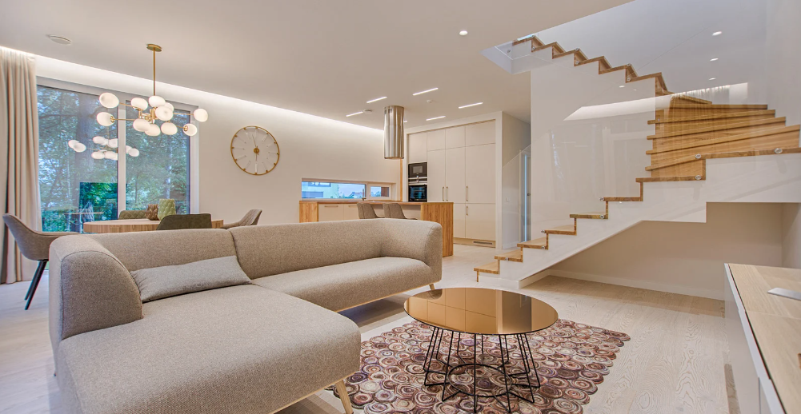

# 360Interiors

 
----

## Introduction 

This is a Power BI project on the sales and demography analysis of **360Interiors**, an interior company. The project's goal is to analyze and derive insights to answer crucial questions and help the company make data-driven decisions. 

Power BI Concepts Applied:

-	DAX Concepts: Calculated columns, custom columns, Year (), IF ()
-	Data Modeling: Star Schema (*:1)
  
**_Disclaimer_**: _All datasets and reports do not represent any company, institution, or country, but just a dummy dataset to demonstrate my capabilities of using Power BI._ 

### Data Cleaning/Preparation

In the initial data preparation phase, we performed the following tasks:

- Data cleaning and inspection
- Handling missing values
- Data cleaning and formatting

### Exploratory Data Analysis (EDA)

EDA involves exploring the sales data to answer key questions such as;
1.	Which state has the highest impact on income in the current year?
2.	Who are the top 5 active and profitable customers?
3.	What is the profit/loss trend from January to December?
4.	What are the KPIs for Total Sales, Profit, and Profit Margin?

## Skills/Concepts Demonstrated

- Bookmarking
- DAX
- Quick measures
- Page navigation
- Modeling
- Filters
- Tooltips
  
## Modeling

Automatically derived relationships are adjusted to remove and replace unwanted relationships with the required ones. 

The model is a star schema. There are 5-dimension tables and 1 fact table. The dimension tables are all joined to the fact table with a one-many relationship. 

## Visualization

The report comprises 2 pages:
1.	Sales Performance
2.	Demography Performance

## Analysis

### Sales Performance

1.	There are 1,202 orders with a worth of more than 470 thousand dollars.
2.	A $61.62 profit was made in the current year.
3.	There is a sudden fall in sales in October which later rose drastically in November and became the highest sales generated in the current year.
   
### Demography Performance

1.	The top profitable customer made a total purchase of $3,200 while the top active customer brought in $9,000 in purchase. 
2.	The state of California brought in a total sale of $88,000 and a profit of $14,000 compared to the state of New York which brought in a total sale of $80,000 and a total profit of $19,000. 

## Conclusion

-	Product category, Furniture brought in a lot of money for the company because most of its customers are in the corporate located in California.
-	The standard class is the preferred shipping mode due to its low price and delivery duration.
  
## Recommendation

- For a deep dive into the analytics, the datasets of the previous years will be required for comparison and data-driven decision-making. 
- Invest in marketing and promotion during peak sales season to maximize revenue.
- Investigate the reason for the sudden fall in sales in October and how to mitigate the issue from happening again.
  

